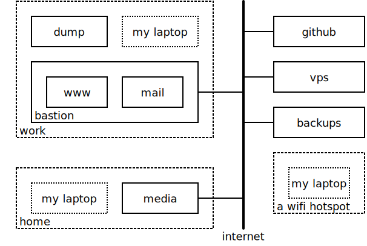

SSH Config
==========

:Author: Ken Kundert
:Version: 1.3.1
:Released: 2020-03-11

Installation Requirements
-------------------------

You can download and install the latest
stable version of the code from `PyPI <https://pypi.python.org>`_ using::

    pip3 install --user sshconfig

You can find the latest development version of the source code on
`Github <https://github.com/KenKundert/sshconfig>`_.

Supported in Python3.6, Python3.7 and Python3.8.

Introduction
------------
SSH Config generates an SSH config file adapted to the network you are currently 
using.  In this way, you always use the fastest paths available for your SSH 
related activities (sshfs, email, vnc, mercurial, etc.). You can also easily 
reconfigure SSH to make use of proxies as needed or select certain servers or 
ports based on your location or restrictions with the network.

The following situations are supported:

#. You may give the mac address or addresses for your router or routers and your 
   network will automatically be recognized.
#. You can configure which hostname or IP address is used for a particular host 
   depending on which network you are on. In this way you always use the fastest 
   connection available for each host.
#. You can specify that certain hosts are hidden behind other hosts, so that 
   a SSH proxy should be used to access them.
#. You can specify port forwarding information for each host. Then, two SSH 
   configurations will be created for those hosts, one that includes port 
   forwarding and one that does not. That way, once the port forwards are 
   established, you can open additional shells on that host without SSH trying 
   to create conflicting port forwards.
#. You can enter multiple hostnames or IP addresses and give their locations.  
   Then, if you specify your location, the closest server will be used 
   automatically.
#. You can specify proxy configurations and specify that one should be used for 
   all hosts not on your current network.
#. You can specify port restrictions and have SSH work around them if possible 
   (if your server supports alternative ports).
#. You can configure a default location, proxy, or set of port restrictions for 
   each of your known networks.
#. Once host names are defined, they do not change even though you are using 
   different configurations (different networks, locations, proxies, and port 
   restrictions). In this way you can hard code your host names in applications 
   such as Mercurial or Git, and they automatically adapt to your existing 
   network.
#. The entire application, including the configuration files, are Python code, 
   so you have considerable freedom to change the configuration based on things 
   like the name of the machine or the user when generating the SSH config file.

Trivial Configuration
---------------------

The hosts that you would like to connect to are described in the hosts.conf 
file.  A very simple hosts.conf file would look like this::

   from sshconfig import HostEntry

   class Zeebra(HostEntry):
       user = 'herbie'
       hostname = 'zeebra.he.net'

Hosts are described by directly subclassing HostEntry.  Attributes are added 
that are generally converted to fields in the SSH config file.  

The contents of ~/.ssh/config are replaced when you run::

   sshconfig

The above hosts.conf file is converted into the following SSH config file::

   # SSH Configuration for unknown network
   # Generated at 1:04 PM on 22 July 2014.

   #
   # HOSTS
   #

   host zeebra
       user herbie
       hostname zeebra.he.net
       forwardAgent no

The transformation between a host entry in the hosts.conf file and the SSH 
config file could be affected by the network you are on and any command line 
options that are specified to *sshconfig*, but in this case it is not. Notice 
that the class name is converted to lower case when creating the hostname.

Configuration
-------------

The configuration of *sshconfig* involves several files contained in 
~/.config/sshconfig directory. Specifically, hosts.conf, locations.conf, 
networks.conf, proxies.conf, and ssh.conf.

Networks.conf
"""""""""""""

This file defines your known networks. It need not define all the networks you 
use, only those where you would like to customize the behavior of *sshconfig*.
A typical networks.conf file might look like::

   #
   # Basic Network Configuration
   #
   # Defines known networks. Recognizes networks by the MAC addresses of their 
   # routers.  Can use this information to set default location, ports, 
   # initialization script and proxy.

   from sshconfig import NetworkEntry

   # Characteristics of the known networks
   class Home(NetworkEntry):
       routers = ['a8:93:14:8a:e4:31']   # Router MAC addresses
       location = 'home'

   class Work(NetworkEntry):
       routers = ['f0:90:76:9c:b1:37']   # Router MAC addresses
       location = 'home'

   class WorkWireless(NetworkEntry):
       routers = ['8b:38:10:3c:1e:fe']   # Router MAC addresses
       location = 'home'

   class Library(NetworkEntry):
       # Blocks port 22
       routers = [
           'e4:c7:22:f2:9a:46',  # Wireless
           '00:15:c7:01:a7:00',  # Wireless
           '00:13:c4:80:e2:89',  # Ethernet
           '00:15:c7:01:a7:00',  # Ethernet
       ]
       ports = [80, 443]
       location = 'home'
       init_script = 'unlock_library_network'

   class DC_Peets(NetworkEntry):
       routers = ['e4:15:c4:01:1e:95']  # Wireless
       location = 'washington'
       init_script = 'unlock-peets'

   # Preferred networks, in order. If one of these networks are not available,
   # another will be chosen at random from the available networks.
   PREFERRED_NETWORKS = ['Work']

All of these entries are optional.

Subclassing NetworkEntry creates a network description that is described with 
the attributes. A subclass will inherit all the attributes of its parent. The 
following attributes are interpreted.

key:
   Name used when specifying the network. If not present, the class name in 
   lower case is used.

description:
   A description of the network. If not given, the class name is used with the 
   following modifications:
   - underscores are replaced by spaces
   - a space is added to separate a lower case to upper case transition
   - double underscores are replaced by ' - '

routers:
   A list of MAC addresses for the router that are used to identify the network.  
   To find these, connect to the network and run the /sbin/arp command.

location:
   The default setting for the location (value should be chosen from LOCATIONS) 
   when this network is active.

ports:
   The default list of ports that should be available when this network is 
   active.

init_script:
   A script that should be run before using this network. May be a string or 
   a list of strings. If it is a list of strings they are joined together to 
   form a command.

   The unlock-peets script is included as an example of such a script. It is 
   used to automate the process of accepting the terms & conditions on the 
   click-through page. Unfortunately, while unlock-peets represents a reasonable 
   example, each organization requires the basic script to be customized to fit 
   their particular click-through pages.

   To write a script it is helpful to understand how the unlocking process 
   works.  The organizations that lock their wifi generally allow your computer 
   to directly connect to their access point, however their firewall is 
   configured to block any network traffic from unapproved devices.  As you 
   connect, they grab the MAC address of your computer's wifi.  They then watch 
   for web requests emanating from your computer, which they then discard and 
   redirect your browser to their router which offers up a page that allows you 
   to accept their terms and conditions.  This page is customized particularly 
   for you: it contains your MAC address. When you accept, your MAC address is 
   returned to the router along with your acceptance, and the router then 
   rewrites its firewall rules to allow your computer to access the internet.  
   After some period of time (an hour? a day?) the rules are discarded and you 
   lose your connection to the Internet.  All of this tremendously abuses 
   Internet protocols, and causes its visitors headaches because this hack is 
   not compatible with HTTPS or VPN traffic. So for it to work, you must request 
   a plain HTTP site with any VPNs disabled, and plain HTTP sites are 
   disappearing.  The headaches this cause seems to provide very little value to 
   anyone. They break the Internet so as to force you to accept their terms and 
   conditions, which they presumably feel protects them from lawsuits, but it is 
   hard to imagine anybody suing the owner of a public wifi for the actions of 
   an anonymous user. But I digress.

   Debugging init scripts can be difficult because once you successfully unlock 
   the wifi, it generally remains unlocked for at least an hour, and maybe until 
   the next day, which limits your ability to test your script.  However, in 
   Linux it is possible to change your MAC address.  If you do so, the router no 
   longer recognizes you and you have to go through the unlock process again, 
   which allows you to thoroughly exercise and debug your script.  To change 
   your MAC address, right-click on the Network Manager applet, and select 'Edit 
   Connection ...', select the connection you are using, and click 'Edit', then 
   copy the 'Device MAC address' into 'Cloned MAC address' and change a few 
   digits. The digits are hexadecimal, so choose values between 0-9A-F. Then 
   click 'Save', 'Close', and restart your network connection.

proxy:
   The name of the proxy to use by default when this network is active.

In addition to the *NetworkEntry* class definitions, this file may also define 
*PREFERRED_NETWORKS*.

*PREFERRED_NETWORKS*:
   A list of strings that specify the preferred networks. It is useful if your 
   computer can access multiple networks simultaneously, such as when you are 
   using a laptop connected to a wired network but you did not turn off the 
   wireless networking.  SSH is configured for the first network on the 
   *PREFERRED_NETWORKS* list that is available. If none of the preferred 
   networks are available, then an available known network is chosen at random.  
   If no known networks are available, SSH is configured for a generic network.  
   In the example, the *Work* network is listed in the preferred networks 
   because *Work* and *WorkWireless* would often be expected to be available 
   simultaneously, and *Work* is the wired network and is considerably faster 
   than *WorkWireless*.

ssh.conf
""""""""

This file allows you to control the entries in your SSH configuration file.
A typical ssh.conf file might look like::

   # Location of output file (must be an absolute path)
   CONFIG_FILE = "~/.ssh/config"

   # Don't scramble known_hosts file on trusted hosts.
   TRUSTED_HOSTS = ['lucifer']

   # Attribute overrides for all hosts
   OVERRIDES = """
       Ciphers aes256-ctr,aes128-ctr,arcfour256,arcfour,aes256-cbc,aes128-cbc
   """

   # Attribute defaults for all hosts
   DEFAULTS = """
       ForwardX11 no

       # This will keep a seemingly dead connection on life support for 10 
       # minutes before giving up on it.
       TCPKeepAlive no
       ServerAliveInterval 60
       ServerAliveCountMax 10

       # Enable connection sharing
       ControlMaster auto
       ControlPath /tmp/ssh_mux_%h_%p_%r
   """

All of these entries are optional.  The following attributes are interpreted.

*CONFIG_FILE*:
    A string that specifies path to the SSH config file. If not given, 
    ~/.ssh/config is used.  The path to the SSH config file should be an 
    absolute path.

*TRUSTED_HOSTS*:
    A list of strings that specifies the host names of trusted hosts. The 
    *known_hosts* file is not scrambled on known hosts. Generally you should 
    only trust hosts that you control. If you do not scramble your *known_hosts*
    file they someone with root privileges could examine you *known_hosts* file 
    and determine which hosts you are using.

*OVERRIDES*:
    A string that specifies the SSH settings that should be used on all hosts,  
    overriding conflicting settings specified in the host entry.  They are 
    simply added to the top of the SSH config file.  Do not place ForwardAgent 
    in OVERRIDES.  It will be added on the individual hosts and only set to yes 
    if they are trusted.

*DEFAULTS*:
    A string that specifies the SSH settings that should be used on all hosts,
    without overriding conflicting settings specified in the host entry.  They 
    are added to the bottom of the SSH config file.

    It is a good idea to add your default algorithms to this entry. You might 
    want to consult `stribika 
    <https://stribika.github.io/2015/01/04/secure-secure-shell.html>`_ when 
    determining which algorithms to use.

In addition, the following are useful when supporting machines with older 
versions of SSH that might not have all the best algorithms.

*AVAILABLE_CIPHERS*:
    A list of available ciphers. If a cipher is specified on a host entry that 
    is not in this list, it is ignored when creating the SSH configuration.

*AVAILABLE_MACS*:
    A list of available MACs. If a MAC is specified on a host entry that is not 
    in this list, it is ignored when creating the SSH configuration.

*AVAILABLE_HOST_KEY_ALGORITHMS*:
    A list of available host key algorithms. If a host key algorithm  is 
    specified on a host entry that is not in this list, it is ignored when 
    creating the SSH configuration.

*AVAILABLE_KEX_ALGORITHMS*:
    A list of available key exchange algorithms. If a key exchange algorithm is 
    specified on a host entry that is not in this list, it is ignored when 
    creating the SSH configuration.

proxies.conf
""""""""""""

This file allows you to define any non-SSH proxies that you might want to use.
A typical proxies.conf file might look like::

   # Known proxies
   PROXIES = dict(
       work_proxy = 'socat - PROXY:webproxy.ext.workinghard.com:%h:%p,proxyport=80',
       school_proxy = 'proxytunnel -q -p sproxy.fna.learning.edu:1080 -d %h:%p',
       tunnelr_proxy = 'ssh tunnelr -W %h:%p',
   )

All of these entries are optional.  The following attributes are interpreted.

*PROXIES*:
   A dictionary that defines each proxy.  Each entry consists of a name and 
   string that would be used directly as the argument for a *proxyCommand* SSH 
   host attribute.  These names can then be specified on the command line so 
   that all hosts use the proxy.

   It is not necessary to add SSH hosts as proxies as with *tunnelr_proxy* above 
   as you can always specify any SSH host as a proxy, and if you do you will get 
   this proxyCommand by default.  The only benefit that adding this entry to 
   PROXIES provides is that *tunnelr_proxy* is listed in the available proxies 
   by *sshconfig settings*.

locations.conf
""""""""""""""

This file allows you to define any locations that you might frequent.  A typical 
locations.conf file might look like::

   # My locations
   LOCATIONS = dict(
      home = 'San Francisco',
      washington = 'Washington DC',
      toulouse = 'Toulouse',
   )

The *LOCATIONS* entry is optional.  It is a dictionary of place names and 
descriptions.  It is needed only if expect to change the server you access based 
on your location.

hosts.conf
""""""""""

A more typical hosts.conf file generally contains many host specifications.

You subclass *HostEntry* to specify a host and then add attributes to configure 
its behavior.  Information you specify is largely just placed in the SSH config 
file unmodified except:

1. The class name is converted to lower case to make it easier to type.
2. 'forwardAgent' is added and set based on whether the host is trusted.
3. Any attribute that starts with underscore (_) is ignored and so can be used 
   to hold intermediate values.

In most cases, whatever attributes you add to your class get converted into 
fields in the SSH host description. However, there are several attributes that 
are intercepted and used by *sshconfig*. They are:

*description*:
   A string that is added as a comment above the SSH host description.

*aliases*:
   A list of strings, each of which is added to the list of names that can be 
   used to refer to this host.

*trusted*:
   Indicates that the host should be trusted (it is fully under your
   control, no untrusted parties have root access).  This enables agent
   forwarding for the host.  If you are using agent forwarding, then it is 
   possible for someone with root permissions to access and use your agent. So 
   you should only mark a host as trusted if you trust the individuals that have 
   administrative access on that machine.

*guests*:
   A list of machines that are accessed using this host as a proxy.

Here is a example::

   class DigitalOcean(HostEntry):
       description = "Web server"
       aliases = ['do', 'web']
       user = 'herbie'
       hostname = '107.170.65.89'
       identityFile = 'digitalocean'

This results in the following entry in the SSH config file::

   # Web server
   host digitalocean do web
       user herbie
       hostname 107.170.65.89
       identityFile /home/herbie/.ssh/digitalocean
       forwardAgent no

When specifying the *identityFile*, you can either use an absolute or relative 
path. The relative path will be relative to the directory that contains the SSH 
config file. Specifying *identityFile* results in *identitiesOnly* and 
*pubkeyAuthentication* being added.  *identityFile* may be a string, or a list 
of strings.  Only those files that actually exist will be used.

*SSHconfig* provides two utility functions that you can use in your hosts file 
to customize it based on either the hostname or username that are being used 
when *sshconfig* is run. They are *gethostname()* and *getusername()* and both 
can be imported from *sshconfig*. For example, I generally use a different 
identity (SSH key) from each machine I operate from. To implement this, at the 
top of my hosts file I have::

   from sshconfig import gethostname

   class DigitalOcean(HostEntry):
       description = "Web server"
       aliases = ['do', 'web']
       user = 'herbie'
       hostname = '107.170.65.89'
       identityFile = gethostname()

Ports
'''''

The default SSH port is 22. However, many ISPs block port 22. For examples, your 
employer may block port 22 to discourage the use of SSH, which makes them 
nervous. Coffee shops also have a habit of blocking port 22. To work around 
these blocks, it is useful to configure SSH to respond to other ports. However, 
if port 22 is blocked, there is a good chance other ports are blocked as well.  
For example, one company I was associated with blocked all but ports 80, 443, 
and 554 (http, https, and real-time streaming protcol) (554 was used by the 
RealPlayer, which was once heavily used but no longer, so port 554 traffic is no 
longer allowed through).  A coffee shop I visited blocked everything but ports 
80 and 443.  Finally, while it is rare to find port 80 blocked, it is common for 
the ISP to pass all port 80 traffic through a transparent http proxy. This would 
prevent port 80 from being used by SSH.  So, if at a very minimum, if you are 
going to configure a server to support multiple SSH ports, you should try to 
include port 443 in your list.  If you would like to support more, I recommend 
22 (SSH), 53 (DNS), 80 (HTTP), 443 (HTTPS).  In my experience, these are the 
least likely to be blocked.

If a host is capable of accepting connections on more than one port, you should 
use the *choose()* method of the ports object to select the appropriate port.

For example::

   from sshconfig import HostEntry, ports

   class Tunnelr(HostEntry):
       description = "Proxy server"
       user = 'kundert'
       hostname = 'fremont.tunnelr.com'
       port = ports.choose([22, 80, 443])
       identityFile = 'tunnelr'

An entry such as this would be used when sshd on the host has been configured to 
accept SSH traffic on a number of ports, in this case, ports 22, 80 and 443.

The actual port used is generally the first port given in the list provided to 
*choose()*.  However this behavior can be overridden with the --ports (or -p) 
command line option.  For example::

   sshconfig --ports=443,80

or::

   sshconfig -p443,80

This causes ports.choose() to return the first port given in the --ports 
specification if it is given anywhere in the list of available ports given as an 
argument to choose(). If the first port does not work, it will try to return the 
next one given, and so on. So in this example, port 443 would be returned.  If 
-p80,443 were specified, then port 80 would be used.

You can specify as many ports as you like in a --ports specification, just 
separate them with a comma and do not add spaces.

In this next example, we customize the proxy command based on the port chosen::

   class Home(HostEntry):
       description = "Home server"
       user = 'herbie'
       hostname = {
           'home': '192.168.1.32',
           'default': '231.91.164.05'
       }
       port = ports.choose([22, 80])
       if port in [80]:
           proxyCommand = 'socat - PROXY:%h:127.0.0.1:22,proxyport=%p'
       identityFile = 'my2014key'
       dynamicForward = 9999

An entry such as this would be used if sshd is configured to directly accept 
traffic on port 22, and Apache on the same server is configured to act as 
a proxy for ssh on port 80 (see `SSH via HTTP 
<http://www.nurdletech.com/linux-notes/ssh/via-http.html>`_.

If you prefer, you can use proxytunnel rather than socat in the proxy command::

   proxyCommand = 'proxytunnel -q -p %h:%p -d 127.0.0.1:22'

You can also use this command for port 443, but you may need to add the -E 
option if encryption is enabled on port 443.

An alternate scenario is that you need to use a port that the host does not 
support.  In this case you would use another server as an intermediate jump 
host.  For example::

   class Backups(HostEntry):
       description = "Backups server"
       user = 'dumper'
       hostname = '143.18.194.32'
       port = ports.choose([22, 80, 443])
       if port in [80, 443]:
           proxyJump = 'tunnelr'
           port = 22
       identityFile = 'my2014key'

In this example *Backups* indicates that it supports ports 22, 80 and 443 even 
though the server itself only supports port 22. However, if port 80 or port 443 
is selected, then *tunnelr* is configured as a jump server. The port must be 
reset to port 22 so that the jump server connects to port 22 on the Backups 
server.

Attribute Descriptions
''''''''''''''''''''''

Most attributes can be given as a two element tuple. The first value in the pair 
is used as the value of the attribute, and the second should be a string that is 
added as a comment to describe the attribute. For example::

   hostname = '65.19.130.60', 'fremont.tunnelr.com'

is converted to::

   hostname 65.19.130.60
      # fremont.tunnelr.com

Hostname
''''''''

The hostname may be a simple string, or it may be a dictionary. If given as 
a dictionary, each entry will have a string key and string value. The key would 
be the name of the network (in lower case) and the value would be the hostname 
or IP address to use when on that network. One of the keys may be 'default', 
which is used if the network does not match one of the given networks. For 
example::

   class Home(HostEntry):
       hostname = {
           'home': '192.168.0.1',
           'default': '74.125.232.64'
      }

When on the home network, this results in an ssh host description of::

   host home
       hostname 192.168.0.1
       forwardAgent no

When not on the home network, it results in an ssh host description of::

   host home
       hostname 74.125.232.64
       forwardAgent no

The ssh config file entry for this host will not be generated if not on one of 
the specified networks and if default is not specified.

It is sometimes appropriate to set the hostname based on which host you are on 
rather than on which network. For example, if a *sshconfig* host configuration 
file is shared between multiple machines, then it is appropriate to give the 
following for a host which may become localhost:: 

   class Home(HostEntry):
       if gethostname() == 'home':
           hostname = '127.0.0.1'
       else:
           hostname = '192.168.1.4'

Location
''''''''

It is also possible to choose the hostname based on location. The user specifies 
location using::

   sshconfig --location=washington

or::

   sshconfig -lwashington

You can get a list of the known locations using::

   sshconfig settings

To configure support for locations, you first specify your list of known 
locations in *LOCATIONS* (in *locations.conf*)::

   LOCATIONS = {
      'home': 'San Francisco',
      'washington': 'Washington DC',
      'toulouse': 'Toulouse',
   }

Then you must configure your hosts to use the location. To do so, you use the 
choose() method to set the location. The choose() method requires three things:

1. A dictionary that gives hostnames or IP addresses and perhaps descriptive 
   comment as a function of the location. These locations are generally specific 
   to the host.
2. Another dictionary that maps the user's locations into the host's locations.
3. A default location.

For example::

   from sshconfig import HostEntry, locations, ports

   class Tunnelr(HostEntry):
       description = "Commercial proxy server"
       user = 'kundert'
       hostname = locations.choose(
          locations = {
              'sf':          ("65.19.130.60",    "Fremont, CA, US (fremont.tunnelr.com)"),
              'la':          ("173.234.163.226", "Los Angeles, CA, US (la.tunnelr.com)"),
              'wa':          ("209.160.33.99",   "Seattle, WA, US (seattle.tunnelr.com)"),
              'tx':          ("64.120.56.66",    "Dallas, TX, US (dallas.tunnelr.com)"),
              'va':          ("209.160.73.168",  "McLean, VA, US (mclean.tunnelr.com)"),
              'nj':          ("66.228.47.107",   "Newark, NJ, US (newark.tunnelr.com)"),
              'ny':          ("174.34.169.98",   "New York City, NY, US (nyc.tunnelr.com)"),
              'london':      ("109.74.200.165",  "London, UK (london.tunnelr.com)"),
              'uk':          ("31.193.133.168",  "Maidenhead, UK (maidenhead.tunnelr.com)"),
              'switzerland': ("178.209.52.219",  "Zurich, Switzerland (zurich.tunnelr.com)"),
              'sweden':      ("46.246.93.78",    "Stockholm, Sweden (stockholm.tunnelr.com)"),
              'spain':       ("37.235.53.245",   "Madrid, Spain (madrid.tunnelr.com)"),
              'netherlands': ("89.188.9.54",     "Groningen, Netherlands (groningen.tunnelr.com)"),
              'germany':     ("176.9.242.124",   "Falkenstein, Germany (falkenstein.tunnelr.com)"),
              'france':      ("158.255.215.77",  "Paris, France (paris.tunnelr.com)"),
          },
          maps={
              'home':       'sf',
              'washington': 'va',
              'toulouse':   'france',
          },
          default='sf'
       )
       port = ports.choose([
           22, 21, 23, 25, 53, 80, 443, 524, 5555, 8888
       ])
       identityFile = 'tunnelr'

Now if the user specifies --location=washington on the command line, then it is 
mapped to the host location of va, which becomes mclean.tunnelr.com 
(209.160.73.168).  Normally, users are expected to choose a location from the 
list given in *LOCATIONS*. As such, every *maps* argument should support each of 
those locations.  However, a user may given any location they wish. If the 
location given is not found in *maps*, then it will be looked for in locations, 
and if it is not in locations, the default location is used.

Forwards
''''''''

When forwards are specified, two SSH host entries are created. The first does 
not include forwarding. The second has the same name with '-tun' appended, and 
includes the forwarding. The reason this is done is that once one connection is 
setup with forwarding, a second connection that also attempts forwarding will 
produce a series of error messages indicating that the ports are in use and so 
cannot be forwarded. Instead, you should only use the tunneling version once 
when you want to set up the port forwards, and you the base entry at all other 
times. Often forwarding connections are setup to run in the background as 
follows::

   ssh -f -N home-tun

If you have set up connection sharing using *ControlMaster* and then run::

   ssh home

SSH will automatically share the existing connection rather than starting a new 
one.

Both local and remote forwards should be specified as lists. The lists can 
either be simple strings, or can be tuple pairs if you would like to give 
a description for the forward. The string that describes the forward has the 
syntax: 'lclHost:lclPort rmtHost:rmtPort' where lclHost and rmtHost can be 
either a host name or an IP address and lclPort and rmtPort are port numbers.
For example::

   '11025 localhost:25'

The local host is used to specify what machines can connect to the port locally.
If the *GatewayPorts* setting is set to *yes* on the SSH server, then forwarded 
ports are accessible to any machine on the network. If the *GatewayPorts* 
setting is *no*, then the forwarded ports are only available from the local 
host.  However, if *GatewayPorts* is set to *clientspecified*, then the 
accessibility of the forward address is set by the local host specified.  For 
example:

=============================== ==============================
5280 localhost:5280             accessible only from localhost
localhost:5280 localhost:5280   accessible only from localhost
\*:5280 localhost:5280          accessible from anywhere
0.0.0.0:5280 localhost:5280     accessible from anywhere
lucifer:5280 localhost:5280     accessible from lucifer
192.168.0.1:5280 localhost:5280 accessible from 192.168.0.1
=============================== ==============================

The VNC function is provided for converting VNC host and display number 
information into a setting suitable for a forward. You can give the local 
display number, the remote display number, and the remote host name (from the 
perspective of the remote ssh server) and the local host name.  For example::

   VNC(lclDispNum=1, rmtHost='localhost', rmtDispNum=12)

This allows a local VNC client viewing display 1 to show the VNC server running 
on display 12 of the SSH server host.

If you give a single number, it will use it for both display numbers.  If you 
don't give a name, it will use *localhost* as the remote host (in this case 
*localhost* represents the remote ssh server).  So the above VNC section to the 
local forwards could be shortened to::

   VNC(12)

if you configured the local VNC client to connect to display 12.

An example of many of these features::

   from sshconfig import HostEntry, ports, locations, VNC

   class Home(HostEntry):
       description = "Lucifer Home Server"
       aliases = ['lucifer']
       user = 'herbie'
       hostname = {
           'home': '192.168.0.1',
           'default': '74.125.232.64'
       }
       port = ports.choose([22, 80])
       if port in [80]:
           proxyCommand = 'socat - PROXY:%h:127.0.0.1:22,proxyport=%p'
       trusted = True
       identityFile = gethostname()
       localForward = [
           ('30025 localhost:25',  "Mail - SMTP"),
           ('30143 localhost:143', "Mail - IMAP"),
           ('34190 localhost:4190', "Mail - Sieve"),
           ('39100 localhost:9100', "Printer"),
           (VNC(lclDispNum=1, rmtDispNum=12), "VNC"),
       ]
       dynamicForward = 9999

On a foreign network it produces::

   # Lucifer Home Server
   host home lucifer
       user herbie
       hostname 74.125.232.64
       port = 22
       identityFile /home/herbie/.ssh/teneya
       forwardAgent yes

   # Lucifer Home Server (with forwards)
   host home-tun lucifer-tun
       user herbie
       hostname 74.125.232.64
       port = 22
       identityFile /home/herbie/.ssh/teneya
       forwardAgent yes
       localForward 11025 localhost:25
           # Mail - SMTP
       localForward 11143 localhost:143
           # Mail - IMAP
       localForward 14190 localhost:4190
           # Mail - Sieve
       localForward 19100 localhost:9100
           # Printer
       localForward 5901 localhost:5912
           # VNC
       dynamicForward 9999
       exitOnForwardFailure yes

Guests
''''''

The 'guests' attribute is a list of hostnames that would be accessed by using 
the host being described as a proxy. The attributes specified are shared with 
its guests (other than hostname, port, and port forwards).  The name used for 
the guest in the ssh config file would be the hostname combined with the guest 
name using a hyphen.

For example::

   class Farm(HostEntry):
       description = "Entry Host to Machine farm"
       aliases = ['earth']
       user = 'herbie'
       hostname = {
           'work': '192.168.1.16',
           'default': '231.91.164.92'
       }
       trusted = True
       identityFile = 'my2014key'
       guests = [
           ('jupiter', "128GB Compute server"),
           ('saturn', "96GB Compute server"),
           ('neptune', "64GB Compute server"),
       ]
       localForward = [
           (VNC(dispNum=21, rmtHost=jupiter), "VNC on Jupiter"),
           (VNC(dispNum=22, rmtHost=saturn), "VNC on Saturn"),
           (VNC(dispNum=23, rmtHost=neptune), "VNC on Neptune"),
       ]

On a foreign network produces::

   # Entry Host to Machine Farm
   host farm earth
       user herbie
       hostname 231.91.164.92
       identityFile /home/herbie/.ssh/my2014key
       forwardAgent yes

   # Entry Host to Machine Farm (with port forwards)
   host farm-tun earth-tun
       user herbie
       hostname 231.91.164.92
       identityFile /home/herbie/.ssh/my2014key
       forwardAgent yes
       localForward 5921 jupiter:5921
           # VNC on jupiter
       localForward 5922 saturn:5922
           # VNC on Saturn
       localForward 5923 neptune:5923
           # VNC on Neptune

   # 128GB Compute Server
   host farm-jupiter
       hostname jupiter
       proxyCommand ssh host -W %h:%p
       user herbie
       identityFile /home/herbie/.ssh/my2014key
       forwardAgent yes

   # 96GB Compute Server
   host farm-saturn
       hostname saturn
       proxyCommand ssh host -W %h:%p
       user herbie
       identityFile /home/herbie/.ssh/my2014key
       forwardAgent yes

   # 64GB Compute Server
   host farm-netpune
       hostname neptune
       proxyCommand ssh host -W %h:%p
       user herbie
       identityFile /home/herbie/.ssh/my2014key
       forwardAgent yes

Subclassing
'''''''''''

Subclassing is an alternative to guests that gives more control over how the 
attributes are set. When you create a host that is a subclass of another host 
(the parent), the parent is configured to be the proxy and only the 'user' and 
'identityFile' attributes are copied over from the parent, but these can be 
overridden locally.

For example::

   class Jupiter(Farm):
       description = "128GB Compute Server"
       hostname = 'jupiter'
       remoteForward = [
           ('14443 localhost:22', "Reverse SSH tunnel used by sshfs"),
       ]

Notice, that Jupiter subclasses Farm, which was described in an example above.  
This generates::

   # 128GB Compute Server
   host jupiter
       user herbie
       hostname jupiter
       identityFile /home/herbie/.ssh/my2014key
       forwardAgent no
       proxyCommand ssh farm -W %h:%p

   # 128GB Compute Server (with port forwards)
   host jupiter-tun
       user herbie
       hostname jupiter
       identityFile /home/herbie/.ssh/my2014key
       forwardAgent no
       proxyCommand ssh farm -W %h:%p
       remoteForward 14443 localhost:22

If you contrast this with farm-jupiter above, you will see that the name is 
different, as is the trusted status (farm-jupiter inherits 'trusted' from Host, 
whereas jupiter does not). Also, there are two versions, one with port 
forwarding and one without.

Proxies
-------

Some networks block connections to port 22. If your desired host accepts 
connections on other ports, you can use the --ports feature described above to 
work around these blocks. However, some networks block all ports and force you 
to use a proxy.  Or, if you do have open ports but your host does not accept SSH 
traffic on those ports, you can sometimes use a proxy to access your host.

Available proxies are specified by adding *PROXIES* in the proxies.conf file.  
Then, if you would like to use a proxy, you use the --proxy (or -P) command line 
argument to specify the proxy by name. For example::

   PROXIES = {
       'work_proxy':   'corkscrew webproxy.ext.workinghard.com 80 %h %p',
       'school_proxy': 'corkscrew sproxy.fna.learning.edu 1080 %h %p',
   }

Two HTTP proxies are described, the first capable of bypassing the corporate 
firewall and the second does the same for the school's firewall. Each is 
a command that takes its input from stdin and produces its output on stdout.  
The program 'corkscrew' is designed to proxy a TCP connection through an HTTP 
proxy.  The first two arguments are the host name and port number of the proxy.  
corkscrew connects to the proxy and passes the third and fourth arguments, the 
host name and port number of desired destination.

There are many alternatives to corkscrew. One is socat::

   PROXIES = {
       'work_proxy':   'socat - PROXY:webproxy.ext.workinghard.com:%h:%p,proxyport=80',
       'school_proxy': 'socat - PROXY:sproxy.fna.learning.edu:%h:%p,proxyport=1080',
   }

Another alternative is proxytunnel::

   PROXIES = {
       'work_proxy':   'proxytunnel -q -p webproxy.ext.workinghard.com:80 -d %h:%p',
       'school_proxy': 'proxytunnel -q -p sproxy.fna.learning.edu:1080 -d %h:%p',
   }

When at work, you should generate your SSH config file using::

   sshconfig --proxy=work_proxy

or::

   sshconfig --Pwork_proxy

You can get a list of the pre-configured proxies using::

   sshconfig --available

It is also possible to use SSH hosts as proxies. For example, when at an 
internet cafe that blocks port 22, you can work around the blockage even if your 
host only supports 22 using::

   sshconfig --ports=80 --proxy=tunnelr

or::

   sshconfig -p80 --Ptunnelr

Using the --proxy command line argument adds a *proxyCommand* entry to every 
host that does not already have one (except the host being used as the proxy).  
In that way, proxies are automatically chained. For example, in the example 
given above *Jupiter* subclasses *Farm*, and so it naturally gets 
a *proxyCommand* that causes it to be proxied through *Farm*, but *Farm* does 
not have a *proxyCommand*. By running *sshconfig* with --proxy=tunnelr, *Farm* 
will get the *proxyCommand* indicating it should proxy through tunnelr, but 
*Jupiter* retains its original *proxyCommand*.  So when connecting to jupiter 
a two link proxy chain is used: packets are first sent to tunnelr, which then 
forwards them to farm, which forwards them to jupiter.

You can specify a proxy on the *NetworkEntry* for you network. If you do, that 
proxy will be used by default when on that network for all hosts that not on 
that network. A host is said to be on the network if the hostname is 
specifically given for that network. For example, assume you have a network 
configured for work::

   class Work(NetworkEntry):
       # Work network
       routers = ['78:92:4d:2b:30:c6']
       proxy = 'work_proxy'

Then assume you have a host that is not configured for that network (Home) and 
one that is (Farm)::

   class Home(HostEntry):
       description = "Home Server"
       aliases = ['lucifer']
       user = 'herbie'
       hostname = {
           'home': '192.168.0.1',
           'default': '74.125.232.64'
       }

   class Farm(HostEntry):
       description = "Entry Host to Machine farm"
       aliases = ['mercury']
       user = 'herbie'
       hostname = {
           'work': '192.168.1.16',
           'default': '231.91.164.92'
       }

When on the work network, when you connect to home you will use the proxy and 
when you connect to farm, you will not.

Examples
--------

Multiple Clients, Multiple Servers, One Set of Config Files
"""""""""""""""""""""""""""""""""""""""""""""""""""""""""""

Imagine having several machines that you log in to directly, call them cyan, 
magenta, and yellow, and imagine that each has its own SSH key, cyan_rsa, 
magenta_rsa, and yellow_rsa. Further imagine that you also have several servers 
that you want to access, mantis, honeybee, and butterfly. Finally, assume that 
you would like to have one set of *sshconfig* files that are shared between all 
of them.

Call cyan, magenta, and yellow the clients, and call mantis, honeybee, and 
butterfly the servers. Finally, the clients do not have fixed IP addresses and 
so will not have entries, meaning that from any client you can get to any 
server, but you cannot access another client.

Then, a *hosts.conf* file for this situation might appear like the following::

    from sshconfig import HostEntry

    identities = ['cyan_rsa.pub', 'magenta_rsa.pub', 'yellow_rsa.pub']

    class Mantis(HostEntry):
        hostname = 'mantis'
        identityFile = identities
        trusted = True

    class HoneyBee(HostEntry):
        hostname = 'honeybee'
        identityFile = identities
        trusted = True

    class ButterFly(HostEntry):
        hostname = 'butterfly'
        identityFile = identities
        trusted = True

From this *sshconfig* creates the following host entries for ~/.ssh/config::

    host butterfly
        hostname butterfly
        identityFile cyan_rsa.pub
        identityFile magenta_rsa.pub
        identityFile yellow_rsa.pub
        identitiesOnly yes
        pubkeyAuthentication yes
        forwardAgent yes

    host honeybee
        hostname honeybee
        identityFile cyan_rsa.pub
        identityFile magenta_rsa.pub
        identityFile yellow_rsa.pub
        identitiesOnly yes
        pubkeyAuthentication yes
        forwardAgent yes

    host mantis
        hostname mantis
        identityFile cyan_rsa.pub
        identityFile magenta_rsa.pub
        identityFile yellow_rsa.pub
        identitiesOnly yes
        pubkeyAuthentication yes
        forwardAgent yes

The private keys are only present on the respective clients. In this way if one 
of the clients is lost or compromised, you can simply remove the corresponding 
public keys from the authorized hosts files on the servers to re-secure your 
hosts.

Each host is trusted and the key is loaded into the SSH agent on the client.  
Access to the key as you move from host to host is provided by agent forwarding.  
Use of the *identityFile* allows you to limit the keys to be considered for each 
host but requires that the specified files exist on each host.  Specifying the 
public keys means that you can keep your private key on the client; you do not 
need to copy it to all the hosts that you use.

One Set of Config Files for a Heterogeneous Environment
"""""""""""""""""""""""""""""""""""""""""""""""""""""""

The previous example was simplified because there is a constant address for all 
the servers. Now consider a collection of machines where how you access 
a machine differs on where you are in the network. Here is a diagram of the 
network. *Host* entries are created for each of the machines that are drawn with 
a solid outline. Those machines that are connected to the internet have public 
IP addresses, those that are not connected to the internet have private 
addresses on a network provided by the enclosing box. Thus, *work* has a network 
that contains *bastion*, *dump* and *my_laptop*. *bastion* contains *www* and 
*mail*, and connects to both *work* and the internet.  *my laptop* shows up in 
three places and switches between them as I move around. Generally the IP 
address of *my laptop* is assigned dynamically.

The following *hosts.conf* file can be used to access these hosts, using optimal 
path in each case::

    from sshconfig import HostEntry, gethostname

    local_host_name = gethostname()

    class Bastion(HostEntry):
        description = 'Work bastion server',
        if local_host_name == 'bastion':
            hostname = '127.0.0.1'
        else:
            hostname = dict(
                bastion = '192.168.122.1',
                work = '10.25.13.4',
                default = '181.78.165.55'
            )
        trusted = True

    class WWW(HostEntry):
        description = 'Web server',
        hostname = '192.168.122.172'
        if local_host_name == 'www':
            hostname = '127.0.0.1'
        elif get_network_name() != 'bastion':
            ProxyJump = 'bastion'
        trusted = True

    class Mail(HostEntry):
        description = 'Mail server',
        hostname = '192.168.122.173'
        if local_host_name == 'mail':
            hostname = '127.0.0.1'
        elif get_network_name() != 'bastion':
            ProxyJump = 'bastion'
        trusted = True

    class Dump(HostEntry):
        description = 'Backups server',
        hostname = '10.25.13.27',
        if local_host_name == 'dump':
            hostname = '127.0.0.1'
        elif get_network_name() != 'work':
            ProxyJump = 'bastion'
        trusted = True

    class Media(HostEntry):
        description = 'Home media server',
        if local_host_name == 'media':
            hostname = '127.0.0.1'
        else:
            hostname = dict(
                home = '192.168.0.2',
                default = '101.218.138.141'
            )
        trusted = True

    class GitHub(HostEntry):
        description = 'GitHub',
        hostname = 'github.com'
        trusted = False

    class VirtualPrivateServer(HostEntry):
        description = 'my virtual private server',
        alias = 'vps'
        hostname = '129.173.134.181'
        trusted = True

    class Backups(HostEntry):
        description = 'home backups',
        hostname = '109.142.233.168'
        trusted = False

First a few words about *bastion*.  If *sshconfig* is run with this file on 
*bastion*, then *local_host_name* will be ``bastion`` and the IP address for 
*bastion* will be set to 127.0.0.1, which is the address a machine assigns to 
itself. Otherwise, if *sshconfig* is run on one of the *bastion* virtual 
machine, then *hostname* gets 192.168.122.1, the address of *bastion* on its 
internal virtual network.  If it run on a machine on the *work* network outside 
of *bastion*, it gets the address of *bastion* on *work* network: 10.25.13.4.  
Finally, for all other machines, the public address is used: 181.78.165.55.  
Thus, in all case the optimal IP address is used.

Now some words about *www* and *mail*, the *bastion* virtual machines. Consider 
*www*. If *sshconfig* is run on *www*, then the hostname is set to 127.0.0.1.  
If it is run on a machine on the *bastion* virtual network, such as *mail*, then 
hostname is set to its address on that network, 192.168.122.172. On any other 
machine *bastion* is used as a jump host. Normally *www* would be described 
using a subclass of *Bastion*, which routes all connections to *www* through 
*bastion*.  However, that is not as efficient when on machines that are on the 
*bastion* virtual network. Thus this approach is a bit more verbose but 
represent an optimal solution from a performance perspective.

Specifying *trusted* as True on a host results in agent forwarding to be enabled 
for that host. If you start on the laptop and visit a trusted host, then your 
SSH agent goes with you, and you can move from a trusted host to any other host 
without typing a passphrase as long as that host accepts a key held in the 
laptop's agent.  Never declare a host as trusted if you do not trust root on 
that host.

Supporting Hosts with Old Versions of SSH
"""""""""""""""""""""""""""""""""""""""""

When a host has an older version of SSH and you are using the SSH algorithm 
settings to harden your connections, then you may run into the situation where 
one or more of your choices is not supported by the dated version of SSH.

There are two situations that must be addressed. First, when run from a machine 
with a newer version of of SSH and connecting to a machine with an older version 
fo SSH, an algorithm must not be required that the older version does not 
support.  In this case one simply specifies the algorithms suitable for 
a particular host in the host entry for that host. For example::

    class Github(HostEntry):
        aliases = ['github.com', '*.github.com']
            # gethub.com is needed because repositories refer to github.com, not github
        hostname = 'github.com'
        hostKeyAlias = 'github-server-pool.github.com'
        user = 'git'
            # when pushing to my repositories I must use the git user
        identityFile = 'github.pub'
        trusted = False
        kexAlgorithms = ','.join([
            'curve25519-sha256@libssh.org',
            'diffie-hellman-group-exchange-sha256',
            'diffie-hellman-group-exchange-sha1',
            'diffie-hellman-group14-sha1'
        ])

Second, when running on the machine with the older version of SSH, modern 
algorithms that are not supported by the older version must not be included in 
the generated SSH config file.  The following *ssh.conf* file shows how to 
accomplish this::

    from sshconfig import gethostname
    from textwrap import dedent

    # Desired Algorithms
    ciphers = ','.join('''
        chacha20-poly1305@openssh.com aes256-gcm@openssh.com
        aes128-gcm@openssh.com aes256-ctr aes192-ctr aes128-ctr
    '''.split())
    macs = ','.join('''
        mac-sha2-512-etm@openssh.com hmac-sha2-256-etm@openssh.com
        umac-128-etm@openssh.com hmac-sha2-512 hmac-sha2-256 umac-128@openssh.com
    '''.split())
    host_key_algorithms = ','.join('''
        ssh-ed25519-cert-v01@openssh.com ssh-rsa-cert-v01@openssh.com
        ssh-ed25519,ssh-rsa
    '''.split())
    kex_algorithms = ','.join('''
        curve25519-sha256@libssh.org diffie-hellman-group-exchange-sha256
    '''.split())

    # Filter Algorithms
    if local_host_name in ['www', 'mail']:
        AVAILABLE_CIPHERS = '''
            3des-cbc aes128-cbc aes192-cbc aes256-cbc aes128-ctr aes192-ctr 
            aes256-ctr arcfour128 arcfour256 arcfour blowfish-cbc cast128-cbc
        '''.split()
        AVAILABLE_MACS = '''
            hmac-sha1 umac-64@openssh.com hmac-ripemd160 hmac-sha1-96 
            hmac-sha2-256 hmac-sha2-512
        '''.split()
        AVAILABLE_HOST_KEY_ALGORITHMS = '''
            ssh-rsa-cert-v01@openssh.com ssh-dss-cert-v01@openssh.com 
            ssh-rsa-cert-v00@openssh.com ssh-dss-cert-v00@openssh.com ssh-rsa 
            ssh-ds
        '''.split()
        AVAILABLE_KEX_ALGORITHMS = '''
            diffie-hellman-group-exchange-sha256 
            diffie-hellman-group-exchange-sha1 diffie-hellman-group14-sha1 
            diffie-hellman-group1-sha1
        '''.split()

        def filter_algorithms(desired, available):
            if available is None:
                return desired
            return [d for d in desired.split(',') if d in available]

        ciphers = ','.join(
            filter_algorithms(ciphers, AVAILABLE_CIPHERS)
        )
        macs = ','.join(
            filter_algorithms(macs, AVAILABLE_MACS)
        )
        host_key_algorithms = ','.join(
            filter_algorithms(host_key_algorithms, AVAILABLE_HOST_KEY_ALGORITHMS)
        )
        kex_algorithms = ','.join(
            filter_algorithms(kex_algorithms, AVAILABLE_KEX_ALGORITHMS)
        )

    DEFAULTS = dedent("""
        host *
            # Use stronger algorithms
            ciphers {ciphers}
            MACs {macs}
            hostKeyAlgorithms {host_key_algorithms}
            kexAlgorithms {kex_algorithms}
    """.format(**locals()))

In this example, the desired algorithms are given first. Then, the algorithms 
supported by the older SSH server are given. These can be found by using ``sss 
-Q``, or if you version of SSH is too old to support the ``-Q`` option, they can 
be found by scouring the *ssh_config* man page. The variable used for the 
available algorithms (those in all caps) are interpreted by *sshconfig*. Any 
algorithm that is not specified as being available is stripped from a host entry 
when generating the SSH config file. If you do not specify from these variable, 
or if they are empty, then no filtering is performed. The available algorithms 
are only defined on the older hosts. That is why this section is embedded in 
a conditional that is only executed when if local_host_name is either ``www`` or
``mail``. These are the hosts with the old version of SSH.

One more thing to look out for when using older versions of SSH; they may not 
support the *proxyJump* setting. You can generally use ``ProxyCommand "ssh 
<jumphost> -W %h:%p"` instead.

Related Software
----------------

`AddSSHKeys <https://github.com/KenKundert/addsshkeys>`_ is a Python utility 
that allows you to add all of your SSH keys to your agent in one go.

Releases
--------

**Latest development release**:
    | Version: 1.3.1
    | Released: 2020-03-11

**1.3 (2020-03-11)**:
   - Add available SSH algorithms filtering.
   - Make SSH settings case insensitive.
   - Added shared config files examples.
   - Refine *identityfile* behavior.
   - Eliminate *tun_trusted*.

**1.2 (2020-01-07)**:
   - Configuration is now external to the program source code (it is now in 
     ``~/.config/sshconfig``).
