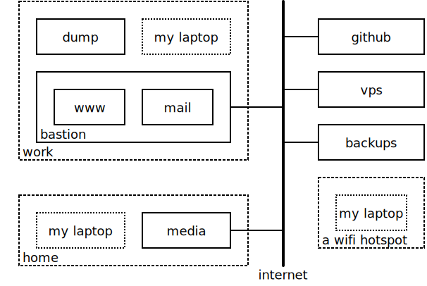

Examples
--------

Multiple Clients, Multiple Servers, One Set of Config Files
"""""""""""""""""""""""""""""""""""""""""""""""""""""""""""

Imagine having several machines that you log in to directly, call them cyan, 
magenta, and yellow, and imagine that each has its own SSH key, cyan_rsa, 
magenta_rsa, and yellow_rsa. Further imagine that you also have several servers 
that you want to access, mantis, honeybee, and butterfly. Finally, assume that 
you would like to have one set of *sshconfig* files that are shared between all 
of them.

Call cyan, magenta, and yellow the clients, and call mantis, honeybee, and 
butterfly the servers. Finally, the clients do not have fixed IP addresses and 
so will not have entries, meaning that from any client you can get to any 
server, but you cannot access another client.

Then, a *hosts.conf* file for this situation might appear like the following:

.. code-block:: python

    from sshconfig import HostEntry

    identities = ['cyan_rsa.pub', 'magenta_rsa.pub', 'yellow_rsa.pub']

    class Mantis(HostEntry):
        hostname = 'mantis'
        identityFile = identities
        trusted = True

    class HoneyBee(HostEntry):
        hostname = 'honeybee'
        identityFile = identities
        trusted = True

    class ButterFly(HostEntry):
        hostname = 'butterfly'
        identityFile = identities
        trusted = True

From this *sshconfig* creates the following host entries for ~/.ssh/config:

.. code-block:: python

    host butterfly
        hostname butterfly
        identityFile cyan_rsa.pub
        identityFile magenta_rsa.pub
        identityFile yellow_rsa.pub
        identitiesOnly yes
        pubkeyAuthentication yes
        forwardAgent yes

    host honeybee
        hostname honeybee
        identityFile cyan_rsa.pub
        identityFile magenta_rsa.pub
        identityFile yellow_rsa.pub
        identitiesOnly yes
        pubkeyAuthentication yes
        forwardAgent yes

    host mantis
        hostname mantis
        identityFile cyan_rsa.pub
        identityFile magenta_rsa.pub
        identityFile yellow_rsa.pub
        identitiesOnly yes
        pubkeyAuthentication yes
        forwardAgent yes

The private keys are only present on the respective clients. In this way if one 
of the clients is lost or compromised, you can simply remove the corresponding 
public keys from the authorized hosts files on the servers to re-secure your 
hosts.

Each host is trusted and the key is loaded into the SSH agent on the client.  
Access to the key as you move from host to host is provided by agent forwarding.  
Use of the *identityFile* allows you to limit the keys to be considered for each 
host but requires that the specified files exist on each host.  Specifying the 
public keys means that you can keep your private key on the client; you do not 
need to copy it to all the hosts that you use.

One Set of Config Files for a Heterogeneous Environment
"""""""""""""""""""""""""""""""""""""""""""""""""""""""

The previous example was simplified because there is a constant address for all 
the servers. Now consider a collection of machines where how you access 
a machine differs on where you are in the network. Here is a diagram of the 
network. *Host* entries are created for each of the machines that are drawn with 
a solid outline. Those machines that are connected to the internet have public 
IP addresses, those that are not connected to the internet have private 
addresses on a network provided by the enclosing box. Thus, *work* has a network 
that contains *bastion*, *dump* and *my_laptop*. *bastion* contains *www* and 
*mail*, and connects to both *work* and the internet.  *my laptop* shows up in 
three places and switches between them as I move around. Generally the IP 
address of *my laptop* is assigned dynamically.

The following *hosts.conf* file can be used to access these hosts, using optimal 
path in each case:

.. code-block:: python

    from sshconfig import HostEntry, gethostname

    local_host_name = gethostname()

    class Bastion(HostEntry):
        description = 'Work bastion server',
        if local_host_name == 'bastion':
            hostname = '127.0.0.1'
        else:
            hostname = dict(
                bastion = '192.168.122.1',
                work = '10.25.13.4',
                default = '181.78.165.55'
            )
        trusted = True

    class WWW(HostEntry):
        description = 'Web server',
        hostname = '192.168.122.172'
        if local_host_name == 'www':
            hostname = '127.0.0.1'
        elif get_network_name() != 'bastion':
            ProxyJump = 'bastion'
        trusted = True

    class Mail(HostEntry):
        description = 'Mail server',
        hostname = '192.168.122.173'
        if local_host_name == 'mail':
            hostname = '127.0.0.1'
        elif get_network_name() != 'bastion':
            ProxyJump = 'bastion'
        trusted = True

    class Dump(HostEntry):
        description = 'Backups server',
        hostname = '10.25.13.27',
        if local_host_name == 'dump':
            hostname = '127.0.0.1'
        elif get_network_name() != 'work':
            ProxyJump = 'bastion'
        trusted = True

    class Media(HostEntry):
        description = 'Home media server',
        if local_host_name == 'media':
            hostname = '127.0.0.1'
        else:
            hostname = dict(
                home = '192.168.0.2',
                default = '101.218.138.141'
            )
        trusted = True

    class GitHub(HostEntry):
        description = 'GitHub',
        hostname = 'github.com'
        trusted = False

    class VirtualPrivateServer(HostEntry):
        description = 'my virtual private server',
        alias = 'vps'
        hostname = '129.173.134.181'
        trusted = True

    class Backups(HostEntry):
        description = 'home backups',
        hostname = '109.142.233.168'
        trusted = False

First a few words about *bastion*.  If *sshconfig* is run with this file on 
*bastion*, then *local_host_name* will be ``bastion`` and the IP address for 
*bastion* will be set to 127.0.0.1, which is the address a machine assigns to 
itself. Otherwise, if *sshconfig* is run on one of *bastion*'s virtual machines, 
then *hostname* becomes 192.168.122.1, the address of *bastion* on its internal 
virtual network.  If it run on a machine on the *work* network outside of 
*bastion*, it gets the address of *bastion* on *work* network: 10.25.13.4.  
Finally, for all other machines, the public address is used: 181.78.165.55.  
Thus, in all cases the optimal IP address is used.

Now some words about *www* and *mail*, the *bastion* virtual machines. Consider 
*www*. If *sshconfig* is run on *www*, then the hostname is set to 127.0.0.1.  
If it is run on a machine on the *bastion* virtual network, such as *mail*, then 
hostname is set to its address on that network, 192.168.122.172. On any other 
machine *bastion* is used as a jump host. Normally *www* would be described 
using a subclass of *Bastion*, which routes all connections to *www* through 
*bastion*.  However, that is not as efficient when on machines that are on the 
*bastion* virtual network. Thus this approach is a bit more verbose but 
represent an optimal solution from a performance perspective.

Specifying *trusted* as True on a host results in agent forwarding to be enabled 
for that host. If you start on the laptop and visit a trusted host, then your 
SSH agent goes with you, and you can move from a trusted host to any other host 
without typing a passphrase as long as that host accepts a key held in the 
laptop's agent.  Never declare a host as trusted if you do not trust root on 
that host.

Accessing the Client
""""""""""""""""""""

Assume that you have logged into your laptop, the client, and used it to access 
a server.  On the server you may need an SSH host entry that gets you back to 
the client. For example, you may have Git or Mercurial repositories on you 
laptop that you need to pull from.  To address this you need two things. First, 
you need to set up a reverse tunnel that allows you to access the SSH server on 
your laptop from the server, and two you need a SSH host entry on the server 
that uses that tunnel to reach your laptop.  The first is provided by the 
*remoteForward* on this example of the *sshconfig* host entry for the server:

.. code-block:: python

    class Dev(HostEntry):
        description = "Development server"
        hostname = '192.168.122.17'
        remoteForward = [
            ('2222 localhost:22', "Reverse SSH tunnel used by Mercurial"),
        ]

The second is provided by adding a *sshconfig* host entry for the client machine 
as seen from the server:

.. code-block:: python

    class Client(HostEntry):
        description = "used for reverse tunnels back to the client host"
        hostname = 'localhost'
        port = 2222
        StrictHostKeyChecking = False

Now your Git and Mercurial repositories use *client* as the name for the 
repository host.  The *StrictHostKeyChecking* is only needed if their might be 
multiple clients

.. _proxies:

Access Restrictions
"""""""""""""""""""

In some situations you may be sitting behind firewalls that prevent direct 
access to your SSH server. Generally, firewalls allow use of common ports, such 
as 80 (http), 443 (https), and perhaps 53 (dns).  In this case, you simply 
configure your SSH server to listen on these ports. This situation is 
illustrated here:

In this case you can simply list the available ports on your host entry and 
specify the desired port when you run *SSHconfig*:

.. code-block:: python

    class SSH_Server(HostEntry):
        hostname = 'NNN.NNN.NNN.NNN'
        port = ports.choose([22, 53, 80, 443])

However, it may be that those ports are already in use. For example, you may 
have a webserver that is using ports 80 and 443.  In this case it is possible to 
insert a proxy that allows these ports to be used for web both and SSH traffic.

If you use Apache for your webserver, it naturally provides the *CONNECT* 
feature that allows it to act as its own proxy. See `SSH via HTTP 
<https://nurdletech.com/linux-notes/ssh/via-http.html>`_ for instructions.
It is also possible to use `sslh 
<https://www.ostechnix.com/sslh-share-port-https-ssh>`_ or `HAproxy 
<https://blog.chmd.fr/ssh-over-ssl-episode-4-a-haproxy-based-configuration.html>`_.

In this case you would specify the proxy using *proxyCommand*. You can either 
add it directly to your host configuration or you can create a named proxy and 
specify it when you run *SSHconfig*.  For example, specifying the proxy on your 
host entry can be done as follows:

.. code-block:: python

    class SSH_Server(HostEntry):
        hostname = 'NNN.NNN.NNN.NNN'
        port = ports.choose([22, 53, 80, 443])
        if port in [80, 443]:
            proxyCommand = 'corkscrew %h %p localhost 22'

SSH replaces %h with the hostname and %p with the port number. In this case 
%h becomes *NNN.NNN.NNN.NNN* and %p becomes the chosen port (either 80 or 443).

In this situation, there are a wide variety of programs that can be used to 
interface with the proxy server. For example:

.. code-block:: python

    proxyCommand = 'proxytunnel -q -p %h:%p -d localhost:22'
    proxyCommand = 'socat - PROXY:%h:localhost:22,proxyport=%p'
    proxyCommand = 'corkscrew %h %p localhost 22'
    proxyCommand = 'ncat --proxy %h:%p --proxy-type http localhost 22'

Those commands all assume you are using an HTTP proxy. If you are using a SOCKS 
proxy, you can use:

.. code-block:: python

    proxyCommand = 'ncat --proxy MMM.MMM.MMM.MMM:PPPP --proxy-type socks5 %h %p'

where *MMM.MMM.MMM.MMM* is the host name or IP address of you proxy, and *PPPP* 
is the proxy's port number (in this case I am not assuming that your SSH sever 
is on the same host as the proxy server.

Another common situation is that your are behind an oppressive corporate 
firewall that blocks all traffic except that which passes through a specific 
pass-through proxy server.  In this case they often perform deep packet 
inspection on the traffic in order to discover and block traffic they find 
undesirable. SSH traffic is often one of their targets.  In this case you can 
often get through by embedding your SSH traffic in an SSL/TLS tunnel.  Doing so 
encrypts the traffic and makes it look like normal web traffic, making it 
impossible to filter out without also risking filtering out normal web traffic.  
In this case, a remote proxy is required at the destination to extract the SSH 
traffic from the SSL/TLS tunnel:

There are variety of ways of embedding your SSH traffic in an SSL/TLS tunnel.  
For example, `stunnel <https://www.stunnel.org>`_ and `HTTP tunnel 
<http://www.nocrew.org/software/httptunnel.html>`_.  One simple way, if your 
server already has Apache running, is to use `SSH via HTTP 
<https://nurdletech.com/linux-notes/ssh/via-http.html>`_ on port 443 with 
SSL/TLS enabled.  Having an active website at the same address and port you are 
using for SSH is particularly desirable as it makes it seem like you are just 
accessing the website normally. `ProxyTunnel 
<https://github.com/proxytunnel/proxytunnel>`_ is used as the interface to the 
proxy servers, as it can form the SSL/TLS tunnel:

.. code-block:: python

    from sshconfig import get_network_name

    class SSH_Server(HostEntry):
        hostname = 'NNN.NNN.NNN.NNN'
        if get_network_name() == 'work':
            proxyCommand = 'proxytunnel -E -q -p MMM.MMM.MMM.MMM:LPP -r %h:RPP -d localhost:%p'

In this example, the pass-through proxy is only used if you are on the *work* 
network and the remote proxy port, *RPP*, is generally chosen to be 443 to 
complete the ruse.

In some cases, it may be that the corporate proxy is decrypting, in which case 
it would be possible for it to use deep packet inspection to determine that you 
are using SSH and block the connection.  At this point, I believe you are out of 
luck.

Once you have established one SSH connection through the firewall, you can 
exploit it to get other connections through.  For example:

.. code-block:: python

    class RemoteProxy:
        hostname = 'MMM.MMM.MMM.MMM'
        port = PPP

    class SSH_Server:
        hostname = 'NNN.NNN.NNN.NNN'
        proxyJump = 'remoteproxy'

In this case, *remoteproxy* is the established SSH connection that pierces the 
firewall, and *ssh_server* uses *proxyJump* to piggy-back on that connection as 
its way to pierce the firewall.

Older versions of SSH do not support *proxyJump*, so the *SSH_Server* host can 
be described using:

.. code-block:: python

    class SSH_Server:
        hostname = 'NNN.NNN.NNN.NNN'
        proxyCommand = 'ssh remoteproxy -W %h:%p'

In this case, SSH replaces %h with the specified hostname, *NNN.NNN.NNN.NNN*, 
and %p with the specified port (22 is used if no port is given).

SSH via Tor
"""""""""""

A convenient way to access machines that have no fixed IP address is to 
configure SSH as a Tor hidden service on that machine as described `here 
<https://nurdletech.com/linux-notes/ssh/hidden-service.html>`_.  This is helpful 
because, as long as Tor is running on both machines and can reach the internet, 
it should be possible to establish a connection regardless of how deeply either 
is buried in private networks.  Here is a host entry for accessing such 
a machine:

.. code-block:: python

    class HiddenLaptop(HostEntry):
        description = "Laptop as Tor hidden service"
        aliases = 'hl'.split()
        hostname = '8owgthc4izjjke9sb4qi5dquhbnug4elcnlbv6pkszybvghylryrodad.onion'
        proxyCommand = 'ncat --proxy localhost:9050 --proxy-type socks5 %h %p'

This assumes that you have Tor running on your client machine and it is 
providing a SOCKS proxy on port 9050, and that SSH is configured as a hidden 
service and Tor is running on the machine you are trying to access.

Supporting Hosts with Old Versions of SSH
"""""""""""""""""""""""""""""""""""""""""

When a host has an older version of SSH and you are using the SSH algorithm 
settings to harden your connections, then you may run into the situation where 
one or more of your choices is not supported by the dated version of SSH.

There are two situations that must be addressed. First, when run from a machine 
with a newer version of of SSH and connecting to a machine with an older version 
fo SSH, an algorithm must not be required that the older version does not 
support.  In this case one simply specifies the algorithms suitable for 
a particular host in the host entry for that host. For example:

.. code-block:: python

    class Github(HostEntry):
        aliases = ['github.com', '*.github.com']
            # github.com is needed because repositories refer to github.com, not github
        hostname = 'github.com'
        hostKeyAlias = 'github-server-pool.github.com'
        user = 'git'
            # when pushing to my repositories I must use the git user
        identityFile = 'github.pub'
        trusted = False
        kexAlgorithms = ','.join([
            'curve25519-sha256@libssh.org',
            'diffie-hellman-group-exchange-sha256',
            'diffie-hellman-group-exchange-sha1',
            'diffie-hellman-group14-sha1'
        ])

Second, when running on the machine with the older version of SSH, modern 
algorithms that are not supported by the older version must not be included in 
the generated SSH config file.  The following *ssh.conf* file shows how to 
accomplish this:

.. code-block:: python

    from sshconfig import gethostname
    from textwrap import dedent

    # Desired Algorithms
    ciphers = ','.join('''
        chacha20-poly1305@openssh.com aes256-gcm@openssh.com
        aes128-gcm@openssh.com aes256-ctr aes192-ctr aes128-ctr
    '''.split())
    macs = ','.join('''
        mac-sha2-512-etm@openssh.com hmac-sha2-256-etm@openssh.com
        umac-128-etm@openssh.com hmac-sha2-512 hmac-sha2-256 umac-128@openssh.com
    '''.split())
    host_key_algorithms = ','.join('''
        ssh-ed25519-cert-v01@openssh.com ssh-rsa-cert-v01@openssh.com
        ssh-ed25519,ssh-rsa
    '''.split())
    kex_algorithms = ','.join('''
        curve25519-sha256@libssh.org diffie-hellman-group-exchange-sha256
    '''.split())

    # Filter Algorithms
    if local_host_name in ['www', 'mail']:
        AVAILABLE_CIPHERS = '''
            3des-cbc aes128-cbc aes192-cbc aes256-cbc aes128-ctr aes192-ctr 
            aes256-ctr arcfour128 arcfour256 arcfour blowfish-cbc cast128-cbc
        '''.split()
        AVAILABLE_MACS = '''
            hmac-sha1 umac-64@openssh.com hmac-ripemd160 hmac-sha1-96 
            hmac-sha2-256 hmac-sha2-512
        '''.split()
        AVAILABLE_HOST_KEY_ALGORITHMS = '''
            ssh-rsa-cert-v01@openssh.com ssh-dss-cert-v01@openssh.com 
            ssh-rsa-cert-v00@openssh.com ssh-dss-cert-v00@openssh.com ssh-rsa 
            ssh-ds
        '''.split()
        AVAILABLE_KEX_ALGORITHMS = '''
            diffie-hellman-group-exchange-sha256 
            diffie-hellman-group-exchange-sha1 diffie-hellman-group14-sha1 
            diffie-hellman-group1-sha1
        '''.split()

        def filter_algorithms(desired, available):
            if available is None:
                return desired
            return [d for d in desired.split(',') if d in available]

        ciphers = ','.join(
            filter_algorithms(ciphers, AVAILABLE_CIPHERS)
        )
        macs = ','.join(
            filter_algorithms(macs, AVAILABLE_MACS)
        )
        host_key_algorithms = ','.join(
            filter_algorithms(host_key_algorithms, AVAILABLE_HOST_KEY_ALGORITHMS)
        )
        kex_algorithms = ','.join(
            filter_algorithms(kex_algorithms, AVAILABLE_KEX_ALGORITHMS)
        )

    DEFAULTS = dedent("""
        host *
            # Use stronger algorithms
            ciphers {ciphers}
            MACs {macs}
            hostKeyAlgorithms {host_key_algorithms}
            kexAlgorithms {kex_algorithms}
    """.format(**locals()))

In this example, the desired algorithms are given first. Then, the algorithms 
supported by the older SSH server are given. These can be found by using ``sss 
-Q``, or if you version of SSH is too old to support the ``-Q`` option, they can 
be found by scouring the *ssh_config* man page. The variable used for the 
available algorithms (those in all caps) are interpreted by *sshconfig*. Any 
algorithm that is not specified as being available is stripped from a host entry 
when generating the SSH config file. If you do not specify from these variable, 
or if they are empty, then no filtering is performed. The available algorithms 
are only defined on the older hosts. That is why this section is embedded in 
a conditional that is only executed when if local_host_name is either ``www`` or
``mail``. These are the hosts with the old version of SSH.

One more thing to look out for when using older versions of SSH; they may not 
support the *proxyJump* setting. You can generally use ``ProxyCommand "ssh 
<jumphost> -W %h:%p"`` instead.

